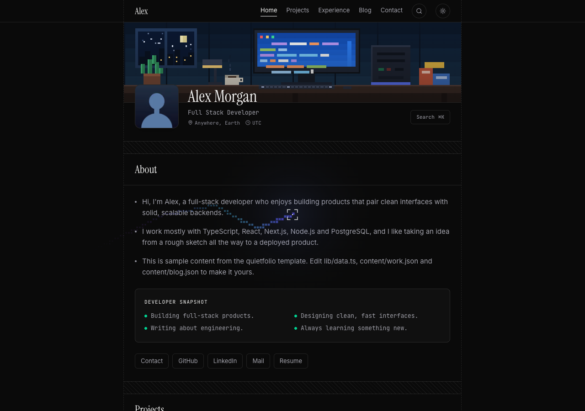
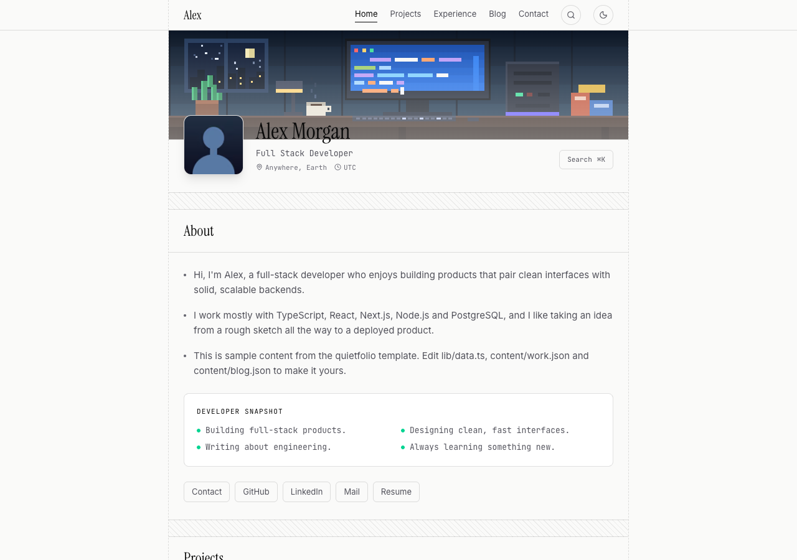
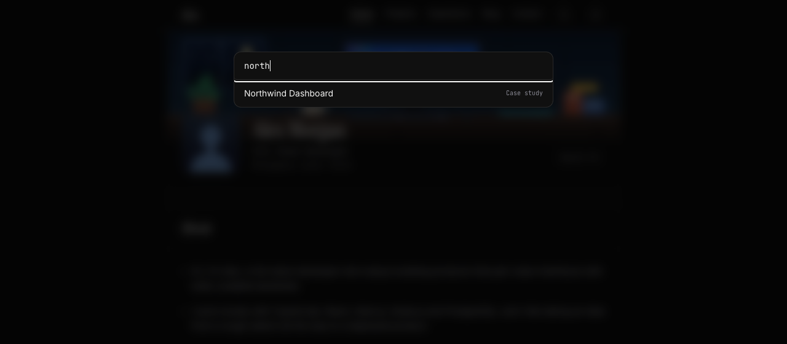
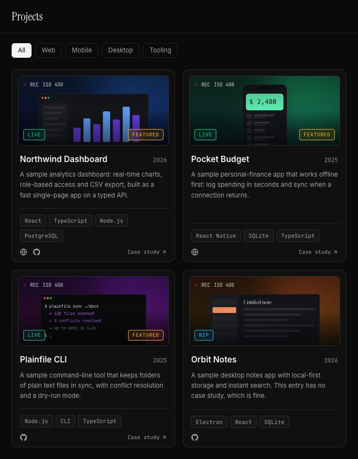
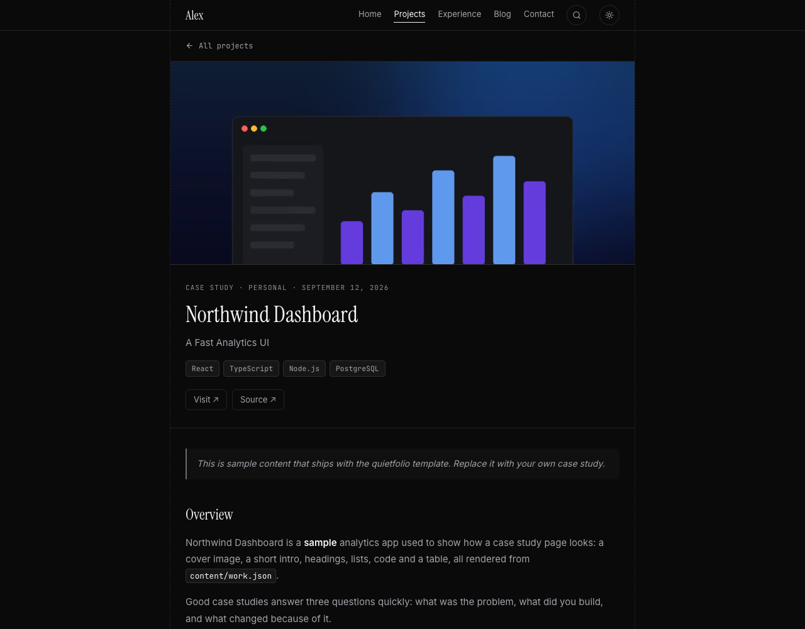
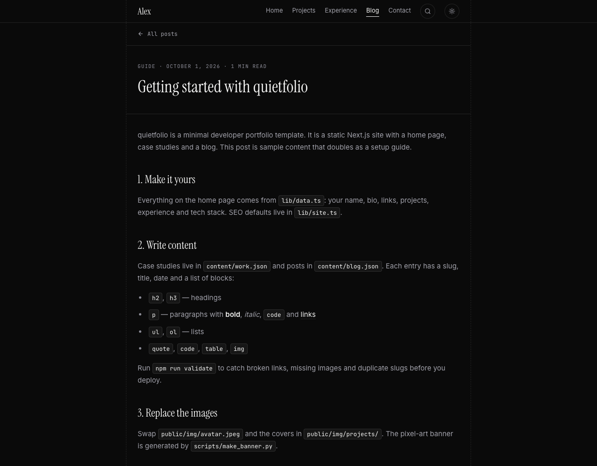
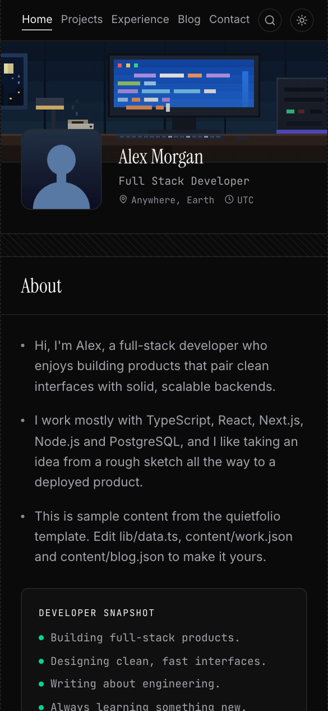
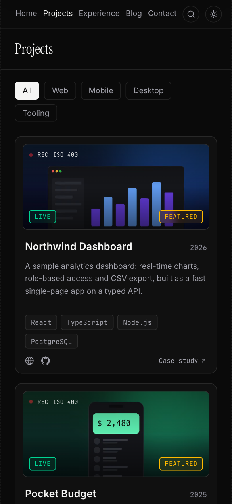
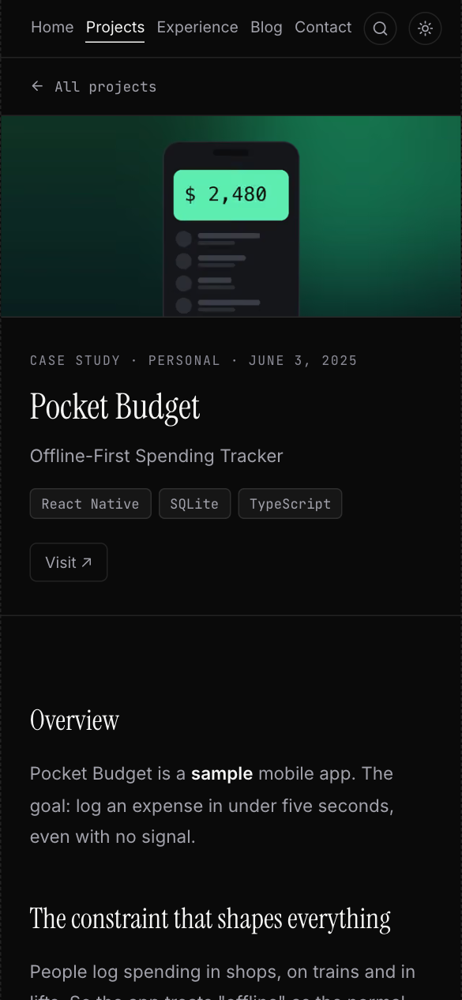

# quietfolio

A minimal, fast, accessible and SEO-first developer portfolio template with projects, case studies and a blog.
Built with **Next.js (App Router)**, **Tailwind CSS v4** and **Framer Motion**. Fully static, no backend.

**Live demo:** https://salahu01.github.io/quietfolio/ (sample content)

<p align="center">
  
</p>

## Screenshots
<table>
  <tr>
    <td width="50%"><br><sub><b>Light theme</b>, no flash on load</sub></td>
    <td width="50%"><br><sub><b>⌘K command palette</b> searches sections, case studies and posts</sub></td>
  </tr>
  <tr>
    <td><br><sub><b>Projects</b> with filters and live, repo and case-study links</sub></td>
    <td><br><sub><b>Case studies</b> rendered from JSON: code, tables, quotes, lists</sub></td>
  </tr>
  <tr>
    <td colspan="2"><br><sub><b>Blog</b> with reading time, RSS and per-post social images</sub></td>
  </tr>
</table>

**Mobile**

<p>
  
  
  
</p>

## Use it
Click **Use this template** on GitHub, or:
```bash
git clone https://github.com/salahu01/quietfolio my-site && cd my-site
nvm use            # Node 22 (.nvmrc)
npm install
npm run dev        # http://localhost:3000
```

## Make it yours (checklist)
1. **You** — edit `lib/data.ts`: name, role, bio, links, projects, experience, tech stack. Set `profile.githubUser` for the activity graph.
2. **Writing** — edit `content/work.json` (case studies) and `content/blog.json` (posts). Run `npm run validate` to catch broken links, missing images and duplicate slugs.
3. **Images** — replace `public/img/avatar.jpeg` and `public/img/projects/*.jpg`. `python3 scripts/make_sample_assets.py` regenerates neutral placeholders.
4. **Brand assets** — `python3 scripts/make_brand_assets.py "Your Name" "Your Role" "yourdomain.com"` regenerates the favicon, Apple icon and social image from your avatar.
5. **SEO** — set `NEXT_PUBLIC_SITE_URL` (see `.env.example`) and review `lib/site.ts` (description, keywords, Twitter handle).
6. **Resume** — `/resume` is a printable page generated from your data. Regenerate the PDF with `npm run build && npm start`, then `npm run resume`.
7. **Banner** — the animated pixel-art banner comes from `python3 scripts/make_banner.py` (needs Pillow). Edit the script to change the scene.

## Features
- Single-page home (about, projects with filters, experience, tech stack, GitHub activity) plus `/work/[slug]` case studies, `/blog` and `/resume`.
- Animated pixel-art banner, pixel cursor trail + focus reticle, dark/light theme (no flash), ⌘K command palette.
- **SEO / AEO / GEO:** per-page metadata and canonical URLs, Open Graph + Twitter cards (per-post generated images), JSON-LD (`Person`, `WebSite`, `ProfilePage`, `TechArticle`, `BlogPosting`, `Blog`, `BreadcrumbList`), `sitemap.xml`, `robots.txt`, RSS (`/feed.xml`), `llms.txt` and `llms-full.txt`, `security.txt`, web manifest.
- **Accessibility:** skip link, landmarks, AA contrast, visible focus, `prefers-reduced-motion` (static banner, no cursor effects), keyboard-operable palette and filters.
- **Hardening:** security headers and a strict CSP in production, no third-party scripts, `X-Powered-By` removed, JSON-LD escaped.

| Script | Purpose |
| --- | --- |
| `npm run dev` | Dev server |
| `npm run build` / `npm start` | Production build / serve |
| `npm run lint` · `npm run typecheck` | ESLint · TypeScript |
| `npm run validate` | Validates `content/*.json`, links and assets |
| `npm run check` | Everything above, in order (what CI runs) |
| `npm run deploy:pages` | Static export → `gh-pages` branch (GitHub Pages) |
| `npm run resume` | Regenerate `public/resume.pdf` |
| `node scripts/make_screenshots.mjs` | Regenerate the README screenshots (see the script header) |

## Content format
Blocks: `h2`, `h3`, `p`, `ul`, `ol`, `quote`, `code`, `img`, `table`. Inline: `**bold**`, `*italic*`, `` `code` ``, `[text](url)`. See the sample posts in `content/blog.json`.

## Configuration
Copy `.env.example`:

| Variable | Default | Purpose |
| --- | --- | --- |
| `NEXT_PUBLIC_SITE_URL` | `https://example.com` | Canonical URL (origin + optional sub-path) for metadata, sitemap, feeds, JSON-LD. A warning is printed at build time if unset. |
| `NEXT_PUBLIC_BASE_PATH` | *(empty)* | Sub-path when served from a folder, e.g. `/my-repo`. Set automatically by `deploy:pages`. |
| `NEXT_PUBLIC_NOINDEX` | *(unset)* | `1` makes the build non-indexable (for demos/mirrors). |
| `STATIC_EXPORT` | *(unset)* | `1` builds a static `out/` folder instead of a Node server build. |

## Deploy
**Netlify / Vercel / any Node host** — connect the repo and set `NEXT_PUBLIC_SITE_URL` to your domain. Security headers, the CSP and the `/work` redirect apply in this mode (`netlify.toml` is included).

**GitHub Pages (static export)** — no server, no Actions required:
```bash
npm run deploy:pages
```
This builds with `STATIC_EXPORT=1`, `NEXT_PUBLIC_BASE_PATH=/<repo>` and publishes `out/` to the `gh-pages` branch. Then in the repo go to **Settings → Pages → Deploy from a branch → `gh-pages` / root**. It is served at `https://<user>.github.io/<repo>/` and does not affect your other Pages sites. Notes:
- Custom headers/CSP and redirects don't exist on a static host, and images aren't optimized at request time (keep images web-sized; `scripts/optimize_images.py` shrinks project covers).
- Demo builds set `NEXT_PUBLIC_NOINDEX=1` so a mirror never competes with your canonical site in search. Remove that variable in `scripts/deploy_pages.sh` if the Pages site is your real one.

After deploying, verify `/sitemap.xml`, `/robots.txt`, `/llms.txt`, `/feed.xml`, and test a page in the [Rich Results Test](https://search.google.com/test/rich-results). Submit the sitemap in Google Search Console and Bing Webmaster Tools.

If you change third-party origins (for example the GitHub activity API), update the CSP in `next.config.ts`.

## Project structure
```
app/            routes, metadata files (sitemap, robots, manifest, OG images, feeds)
components/     UI (Hero, Projects, Navbar, CursorFx, JSON-LD, article renderer…)
content/        case studies + blog posts (JSON)
lib/            data, site config, SEO helpers, content loader
public/img/     images
scripts/        asset generators, content validator, deploy script
```

## Contributing
See [CONTRIBUTING.md](CONTRIBUTING.md), [SECURITY.md](SECURITY.md) and [CODE_OF_CONDUCT.md](CODE_OF_CONDUCT.md).

## License
[MIT](LICENSE).
